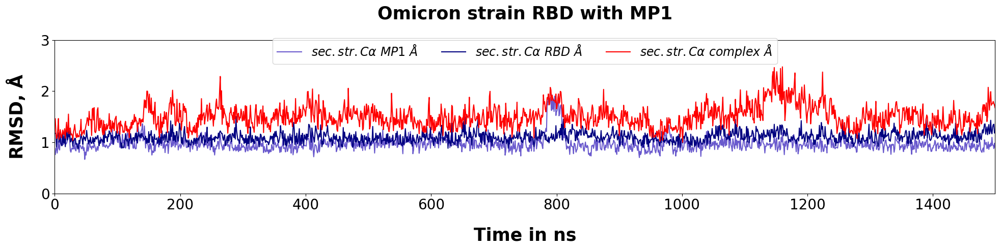

# 2. RMSD calculation and plotting
Requirements:
- pyxmolpp2

During this step the acquired trajectories are analysed to calculate and plot RMSD.

1. During complexes structures preparation the numbering in the files was switched from origonal rscb numbering to continuous. For the RMSD calculation and subsequent analyses the renumbered structure is created `protein_named.pdb` inside '0_prepare' subdir of Amber simulation dir. Check `mutants` variable inside the script to specify complexes for renumbering:
```sh
python renumber_residues_as_in_rcsb.py
```
2. `calc_rmsd.py` and `calc_rmsd_wt+pmc.py` will calculate RMSD of secondary structured Ca atoms across the trajectory with 1 ns stride (or 1000 frames, which can be changed in `stride` variable) and write output to .csv table in 'rmsd_output' dir. 5 columns will contain: time (ns), rmsd for MP, for RDB, for complex, for MP's helices on RDB interface, for MP's helix distanced from the interface. The list of complexes to be analyzed is listed in `mutants` variable. The script is command-line friendly and can be called by next command:
```sh
python3 calc_rmsd.py -i ../../2_MD_Amber/sample/ -m alpha -o ../tables/
```

For simultanious analysis of all strains use the following command:
```sh
for s in $(echo alpha delta delta_plus); do python3 calc_rmsd.py -i ../../2_MD_Amber/sample/ -m ${s} -o ../tables/ ; done
```

**!NB:** wt and omicron variants ought to be analyzed by separate script `calc_rmsd_wt+pmc.py` due to directories specifications:
```sh
for s in $(echo wt omicron); do python3 calc_rmsd_wt+omc.py -i ../../2_MD_Amber/sample/ -m ${s} -o ../tables/ ; done
```
3. The precomputed output .csv files are contained in 'tables' dir. They can be plotted with `rmsd_plot.py`. Function takes path to folder with .csv data as -i variable and the output directory as -o key. The plot with RMSD distributions of MP, RBD and complex per ns will be obtained. By default plots for all variants are prepaired. To specify mutants - vairable `mutants` should be replaced with desirable list of names.
```sh
python3 rmsd_plot.py -i ../tables/ -o ./
```
Note that possible mutants and corresponding titles are listed inside the script in `mutants`, `titles` variables. If you add new variants to the analysis, update those variables. And any plot features are free to be editted.

*The plots are saved in the current directory.*

# Obtained results:

All the results can be obtained from `result_plots` directory.

As a result, RMSD plots are obtained for all simulated trajectories. Quite stable RMSD patterns are observed for all complexes, although there are minor fluctuations in some cases. The distirbutions of MP, RBD and complexes RMSD shows that these fluctuations are mostly contributed by MP RMSD variation. Indeed, the visual examination of trajectories by VMD or any other tools showed that motion can be noticed for MP regions but not for RBD ones. Moreover, MP1 flexible regions do not include interface residues, thus don't affect complex stability. 

Below is an example for MP1/omicron RDB complex:

<p align="center">
  
</p>

