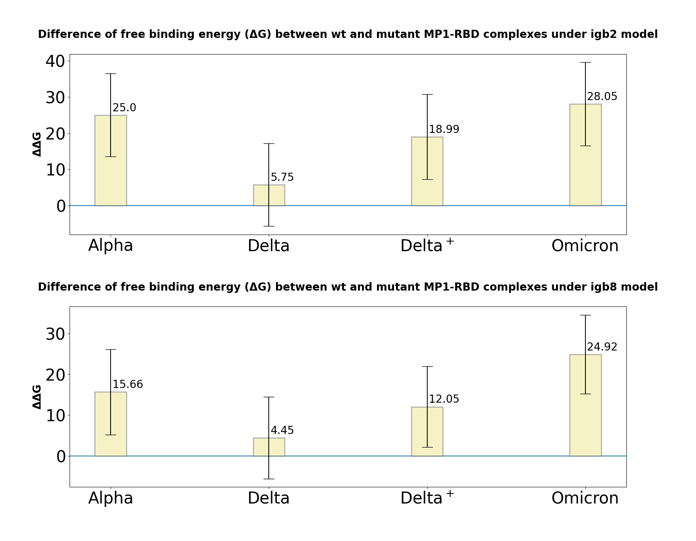

# 4. MM-GBSA binding free energy estimation
Requirements:
- Amber20
- mpi

Within this step MM-GBSA calculations are performed to estimate binding free energy of MP1 with different RDB variants. 

- MM-GBSA jobs are prepared at the MD folders and saved as state.dill objects at '7_mmpbsa' subdirs;
- Two models of solvate are used in scripts: igb2 and igb8. To our experience, their results are quite consistent, so employing igb8 could be sufficient;
- Salt concentration is set to 0.15M;
- `script150_igb2.in` and `script150_igb8.in` scripts contain parameters for MM-GBSA runs. These can be modifyed with additional parameters if neccessary (see Amber manual);
- By default 1000 frames from trajectory are used with 1 ns stride starting from 500 ns of simulation. The omition of first 500 ns is provided to avoid fluctuations caused by complex relaxation and stabilization. The span from 500 ns corresponds to an equilibrated complex configuration.

1.  Execute `prep_MMPBSA_jobs.py` after scpecifying the list of complexes for analysis in `mutants` variable. Note that this script assumes working with MPI, therefore mpi-amber assembly is needed:
```sh
python3 prep_MMPBSA_jobs.py
```
2. Run jobs by executing (don't forget to specify mutants):
```sh
sbatch run_slurm.sh
```
3. Amber produces summary in .dat format, however for a detailed analysis \_MMPBSA\_info file should be parsed using Amber's API as API nexted dictionary-like structure. To summarize MM-GBSA result execute `mmpbsa_summary.py`. The main function `sum_gbsa` iterates over `mutants` variable which can be reassigned (by default - summary for all variants is generated). This will create .tsv tables with data on total complex, ligand and receptor energies. The column 'deltaG' will contain binding free energies found as: G(complex) - G(ligand) - G(receptor). Precomputed tables for MP1 are available in 'tables'.

The function takes path to trajectories, conatining 7_mmpbsa folder as -i key, output file path as -o argument and -y key setting should the pickle be overwritten or not.

```sh
python3 mmgbsa_summary.py -i ../../2_MD_Amber/sample/ -o ../tables -y y
```
4. In order to plot MM-GBSA binding free energies execute `gbsa_barplot.py` providing the path to data folder. The plot represents the result for both solvate models (igb2 and igb8) and ddG variance for mutant. Variance here - the difference between wt and mutant binding energies. The data includes metrices precomputed from 500 ns:
```sh
python3 gbsa_barplot.py -i ../tables/ -o ./ -r 2
```
The plots are saved in the current directory. If you add new complex type to the analysis, modify `mutants` and `labels` variables inside the script.

# Obtained results:

All the results can be obtained from `result_plots` directory.

MM-GBSA results represent ΔΔG in relation to MP1/wt complex. This metric was choen as being more convinient for representation of free binding energy change from wt state of complex. Depending on the model chosen for MM-GBSA calculation (igb2 or igb8) predictions don't differ. Binding free energy estimations shows that in the case of all mutants MP1 affinity dramatically decrease (see ΔΔG bar charts below). Among which omicron possesses the most significant drop of ΔG.  

<p align="center">
  
</p>

