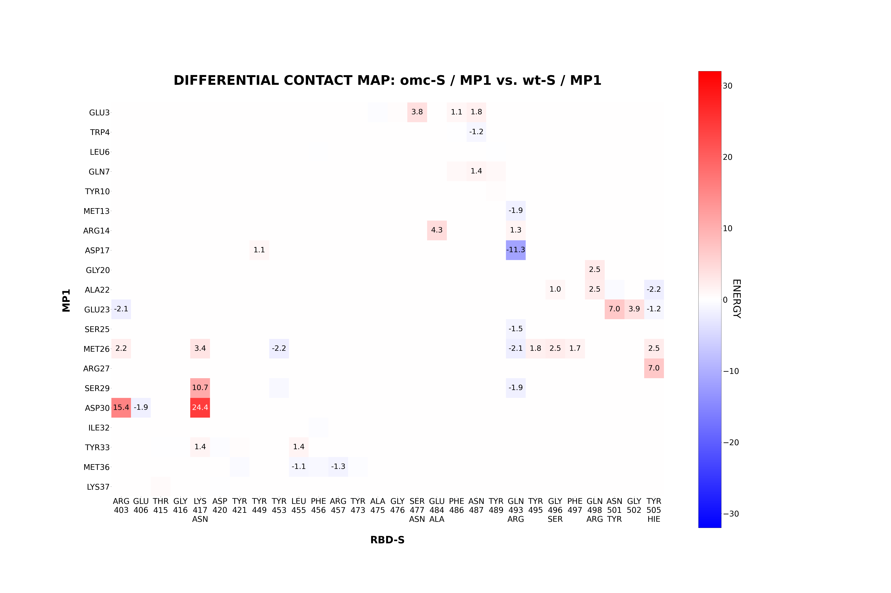
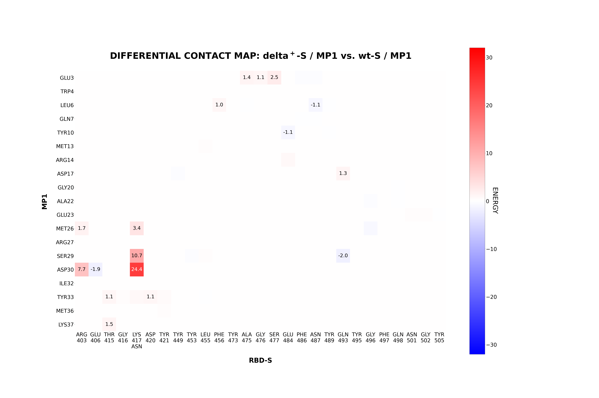
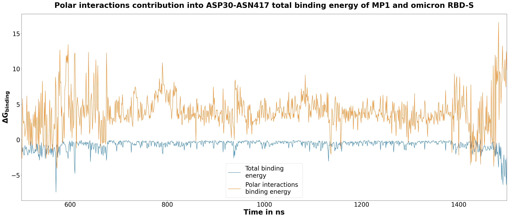

# 4. MM-GBSA binding free energy estimation
Requirements:
- Amber20
- mpi

Within this step MM-GBSA decomposition calculations are performed to investigate contributions of distinct residue pairs in MP1/RBD binding. 

- MM-GBSA_decomposition jobs are prepared at the MD folders and saved as state.dill objects at '8_mmpbsa_decomposition' subdirs
- Two models of solvate are used in scripts: igb2 and igb8. To our experience, their results are quite consistent, so employng igb8 could be sufficient
- Salt concentration is set to 0.15M
- `igb2_salt150_decomp.in` and `igb8_salt150_decomp.in` are template scripts containing parameters for MM-GBSA runs. These are modifyed with `decomp` parameters during the search of residues on interface MP1-RBD pairs. These can be modifyed with additional parameters if neccessary
- By default 1000 frames from trajectory are used with 1 ns stride starting from 500 ns of simulation. This span corresponds to an equilibrated complex configuration.

0. A list of interface residues is required to run decomposition. This list is found using `interface_res_trj.py`. **Note:** this script operates on 7_mmpbsa/mmpbsa.nc trajectory assembled in step №4 for MM-GBSA. If you want to skip MM-GBSA calculations, at least execute `prep_MMPBSA_jobs.py` to create thess .nc files.
The script will write .txt files with interface residues and their trajectory occurancies in % in `tables` directory and print spans of interfce residues ids for decomposition .in scripts in stdout. Also .in files will be created and saved in model-specified subdir in 8_mmpbsa_decomposition directory:
```sh
python3 interface_res_trj.py
```

**!NB** The set of residues on interface is considered to be constant among all variants thus only the wt set is used for .in files creation.

1. Execute `prep_MMPBSA_decomposition.py` after scpecifying the list of complexes for analysis in `complexes` variable. The list of interface residues to be analyzed is provided inside the script as `roi` variable. Note that this script assumes working with MPI, therefore mpi-amber assembly is needed:
```sh
python3 prep_MMPBSA_decompositions.py
```
2. Run jobs by executing (don't forget to specify mutants in $STRAINS variable in the format `strain+mp1`):
```sh
sbatch run_slurm_decomp2.sh
```
3. Amber produces summary in .dat format, however for a detailed analysis \_MMPBSA\_info file should be parsed using Amber's API as API nexted dictionary-like structure. To summarize MM-GBSA result execute `decomp_analysis.py`. The main function `sum_gbsa_decomp` iterates over `mutants` variable which can be reassigned (by default - summary for all variants is generated). This will create .tsv tables with data on total complex, ligand and receptor energies. The column 'deltaG' will contain binding free energies found as: G(complex) - G(ligand) - G(receptor). Precomputed tables for MP1 are available in 'tables'.

Note that processing can take a while, because \_MMPBSA\_info is time-consuming. However, after first script run the parsed data is dumped into picke, so the next parsing will be more rapid. By default frames are analyzed starting from 500. It can be changed in `first_frame` variable inside the script. Also the the overwriting of pickle is possible in the casethe key -y would be set n/N/No (whatever except "y").
```sh
python3 decomp_analysis.py
```

4. In order to plot decomposition results as differential contact maps use `plot_decomp_result_1.py`. By dafault for both solvate models plots are created. To specify the only - change iteration script sctructure. Also for all mutants maps are contructed, however the list can be specified by `mutants` variable in the script body. The wt directory should also be provided (in the case you have another folder structure):
```sh
python3 plot_decomp_result_1.py -i ../tables -w ../../2_MD_Amber/sample/wt+mp1_2/0_prepare/protein_named.pdb -t ../../2_MD_Amber/sample -o ./
```
The plot is saved to the current directory. 

5. The contribution of polar interactions into the specific residue pair free binding energy change is also obtained from obtained MM-PBSA decomposition results. The information is extracted by `polar_contribution.py` script, processesing obtained data and extracting total free binding energy and polar interaction free binding energy into .tsv table. These tables are saved in ../tables directory. The function takes trj analysis directory and output folder as -i and -o key, consequently, and MP, RBD residues of iterest as -r1,-r2 keyin the format: `AA№`. Amino acid should be written in the three letter format, followed by residue number. 

By default for all mutants these interactions are analysed. The plot reflects the distribution of free binding energy dependence on time of simulations. To specify exact variants for the analysis `mutants` variable chould be changed inside the script.
```sh
python3 polar_contribution.py -i ../../2_MD_Amber/sample -r1 ASP30 -r2 ASN417 -o ../tables
```

6. The illustration of the polar contribution is obtained by `plot_polar_contribution.py` script. The distributions of polar interactions energy and total energy from 500 ns is reflected. By default for all mutants the plot is generated. It takes data obtained on the previous step by `polar_contribution.py` script. To define the pair of residues to plot the key -r should be assigned. Below the example command for ASP30-ASN417 residue pair is stated.
```sh
python3 plot_polar_contribution.py -i ../tables/ -r ASP30-ASN417 -o ./
```

# Obtained results:

All the results can be obtained from `result_plots` directory.

## 1.1 Decomposition analysis 
MM-GBSA decomposition allows a detailed analysis of residue interactions. Results are plotted as differential contact maps providing ineraction energy difference between each complex and respective pairs in MP1/wt RDB complex. Only residues interactions with the binding energy less than -1 are represented.

The results show that there is a local interaction contributing mostly into free binding energy chagings. This pattern is specific for almost all variants, though the most significant contribution is presented for delta+ and omicron variant, caused by mutation of Lys417 to Asn417. Thus the results for omicron/MP1 complex would be described below.

Omicron strain inherits mutation presented in alpha and delta strains, however the effect from them is enhanced. Contact map for the complex with omicron (first figure) and delta+ (second figure) highlights a strong local interaction between Asp30 in MP1 and mutated to Arg417 in RBD, which takes the major part of overall increase in ΔG binding. This is explained by Lys to Asn substitution, which could lead to the disappearence of electrostatic interactions (e.g. disruption of salt bridges) with Asp30 and Ser29 of MP1. Though also slight stabilizing interaction is presented between Asp17 of MP1 and mutated from Gln493 to Arg493 of RBD. 

<p align="center">
  
</p>

In comparison, contact maps for delta+ with MP1 shows, that while destabilizing interactions overlaps with those for omicron/MP1, any stabilizing ones were described.

<p align="center">
  
</p>

## 1.2 Polar contribution analysis
MM-GBSA decomposition analysis data provides the information not only for the total binding energy estimation, but also polar interactions caused scores. From decomposition results the contribution of polar interactions into complex affinity decrease was proposed. To check the existance of correlation between total binding energy and its polar interaction part the distributions of them are compared. The X axis represents the ns intervals, and free binding energy scores lie on the Y axis.

Herein the contribution of polar interactions into omicron/MP1 total binding energy fluctuations is shown. Indeed, the decrease of MP1 affinity to omicron RBD depends on the increased effect of polar interactions. 

<p align="center">
  
</p>
