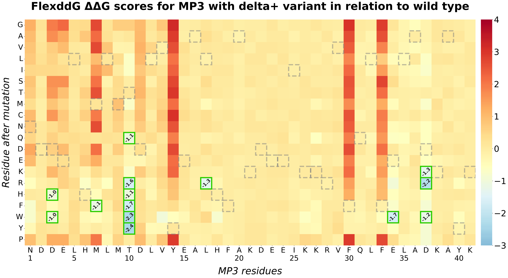
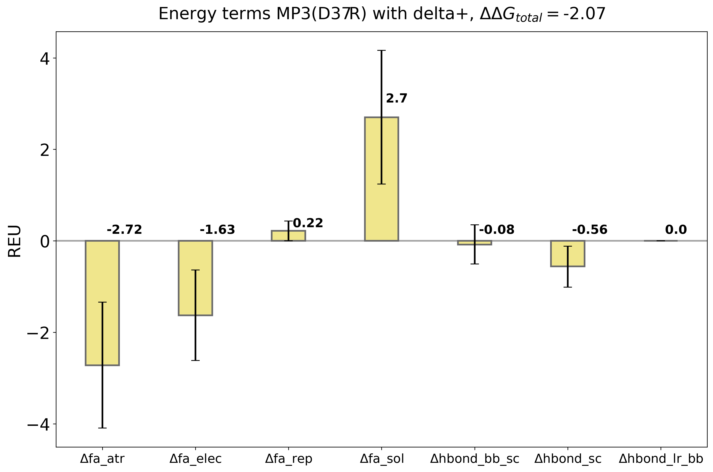
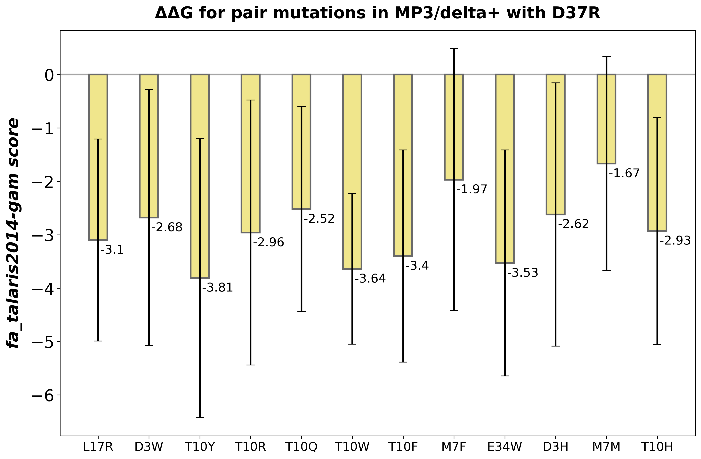
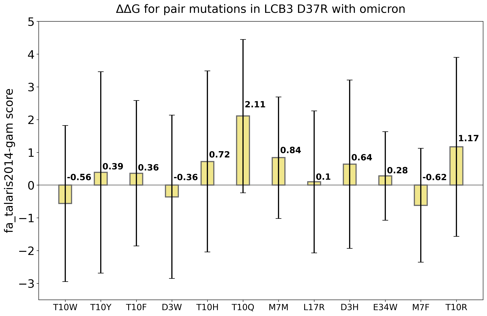

# 1. Flex ddG
Requirements:
- [pyxmolpp2](https://github.com/sizmailov/pyxmolpp2) (1.6.0)
- [md-utils](https://github.com/OOLebedenko/md-utils)
- Rosetta2
- slurm

[Flex ddG](https://pubs.acs.org/doi/10.1021/acs.jpcb.7b11367) is a method within the `Rosetta` macromolecular modeling suite, that samples conformational diversity using “backrub” to generate an ensemble of models and then applies torsion minimization, side chain repacking, and averaging across this ensemble to estimate interface ΔΔG values.  
The present analysis is based on [Flex ddG tutorial](https://github.com/Kortemme-Lab/flex_ddG_tutorial) and consists of saturation mutational scan and pair mutations scan.

## 1.1 Saturation analysis

During this step all residues from specifyed range in MP3 are mutated to each possible amino acid and respective ΔΔG is estimated. Scripts for this step are located at `scripts/saturation_analysis`.

1. Navigate to `scripts/saturation_analysis`
```sh
cd scripts/saturation_analysis
```
2. Scipts will operate upon `template` folder. The sample is provided for MP3/delta+ variant complex saturation mutational scan:
2.1  Check the content of `input/pdb` dir. File `chains_to_move.txt` contains the name of the MP3 chain (as in .pdb file), which will be mutated. Structure `delta_plus+mp3_minimized.pdb` is a structure prepared at the step №0. Files `pdb2rosetta.resmap.json` and `rosetta2pdb.resmap.json` contain information to link rosetta and pdb structure numbering. These are applicable for all MP3-RBD variants since the number of residues is fixed
2.2 Enter path to rosetta_scripts.mpi in `run_saturation.py`. You can also change default FlexddG settings (maximum cpus, backrub steps, covergence threshols etc.)
2.3 This project uses `slurm` to run computation tasks. You can change job parameters specified in `flexddg.sh`
3. In `create_flex_ddg_run_dir.py` check 'path_to_pdb' variable, which specifyes path to `...minimized.pdb.` Execute the script. It will create subdirs for each residue in MP3:
```sh
python create_flex_ddg_run_dir.py
```
4. Run analysis in all subdirectories. This may take about a week, depending on your computational resources:
```sh
sbatch run_sh_in_subdirs.sh
```
5. When FlexddG run finishes, execute `analyze_flexddg.py`. It will create 'analysis_output' folders in all residue subdirectories with .csv tables containing results summaries:
```sh
python analyze_flexddg.py
```
6. Tables produced with `analyze_flexddg.py` contain information with many parameters. In order to filter information for plotting use `summarize_ddG.py`, which is located above 'saturation_analysis' dir. This script works as command-lone tool, help is available: 
```sh
cd ..
python summarize_ddG.py -h
```
Example command:
```sh
python summarize_ddG.py -i ./saturation_analysis -s ddg -b 35000 -n 35 -f fa_talaris2014-gam -o mutation_data_delta_plus_MP3
```
7. When results are extracted you can plot a heatmap with `plot_saturation_mutation_results.py`. You can try script on sample data provided in 'tables' dir (mutation_data_delta_plus_MP3.csv or mutation_data_omicron_MP3.csv). This script works as a command-line tool. The example command:
```sh
python plot_saturation_mutation_results.py -h # to get help
python plot_saturation_mutation_results.py -i ../tables/mutation_data_delta_plus_MP3.csv -mutant delta+ -o ..
```
8. You can analyse discrete mutations and assemble a barplot of contributions to rosetta scores with `plot_score_contributions.py`. This script works as a command-line tool. Note: this script requires path to .csv at 'analysis_output' subdirectories generated with `analyze_flexddg.py` from Flex ddG run. Use data with the suffix 'struct_scores_results.csv'. The sample `output_struct_scores_delta_plus_37Asp.csv` is provided in 'tables'. The example command:
```sh
python plot_score_contributions.py -g # to get help
python plot_score_contributions.py -i ../tables/output_struct_scores_delta_plus_37Asp.csv -mutant delta+ -start_res D -pos 37 -mut_res R -b 35000
```

**Obtained results:**  
After performing saturation mutational scan, heatmaps with Flex ddG scores for each mutation can be plotted. Mutations with scores below -1 are considered stabilizing and are highlighted in green. Substitutions to the same residue are highlighted in gray dashed boxes. Below are results for delta+ and omicron complexes. It is evident, that for omicron fewer stabilizing mutations are found, which is consistent with MM-GBSA results shiwing stabilization of MP3/omicron complex (therefore not many stabilizing mutations are possible).

<p align="center">
  
</p>

<p align="center">
  
</p>

In case of MP3/delta+ a fovourable D37R mutation is found. This mutation to polar Arg residue may lead to formation of new polar interactions. Patricular contributions to Flex ddG score for this mutation can be visualized as bar plot. In this case, polar Δhbond contributions does not seem to be major, however a detailed investigation with MD and MM-GBSA decomposition is needed to check the effect of this mutation.

<p align="center">
  
</p>


## 1.2 Pair mutations analysis

In order to investigate pairs of mutations in MP3, execute scripts in `scripts/pair_mutations`. The sample is also provided for delta+ variant complex. Data at `inputs` dir is organised in the same manner as for saturation mutational scan. 
  
Examine `run_mutation.py`. It differs from such script in `saturation_analysis` in a way which `residue_combinations_to_mutate` variable is specifyed. Here a list of pair mutations to perform is provided as follows: [Chain, tuple(PDB residue numbers), tuple(new residues in single letter notation)].

0. Navigate to:
```sh
cd scripts/pair_mutations
``` 
1. After setting desired parameters and Rosetta2 path in `run_mutation.py`, execute:
```sh
sbatch flexddg.sh
```
2. Once analysis is finished:
```sh
python analyze_flex_ddG.py
```
3. Draw a barplot of acquired ΔΔG values with `plot_pair_mutation_results.py`. This script accepts path to `...-struct_scores_results.csv`, generated by `analyze_flex_ddG.py`, and filters it prior to plotting. You can use sample data from `tables` dir (delta_plus_MP3_pair_mutations.csv and omicron_MP3_pair_mutations.csv). The example command of the command-line tools script:
```sh
python plot_pair_mutation_results.py -g # to get help
python plot_pair_mutation_results.py -i ../tables/delta_plus_MP3_pair_mutations.csv -p pair_mutations/inputs/pdb_deltap/delta_p+mp3_minimized.pdb -mutant delta+ -s D37R -b 35000 -n 35 -f fa_talaris2014-gam
```
**Note** that this script operates upon assumtion that 1 mutation is being fixed across all pairs.

**Obtained results:**   
In order to find MP3 variants with two mutations a pair mutational scan is conducted. Pairs consist of D37R substitution and each stabilizing mutation found for MP3/delta+ complex earlier. Visualization of FlexddG scores with a box plot demonstrates, that all studied combinations are stabilizing for delta+ complex. The best result corresponds to T10W+D37R combination as it has one of the lowest scores and deviations. All combinations of mutations are destabilizing for omicron complex and are rather illustrative here.

<p align="center">
  
</p>

<p align="center">
  
</p>
