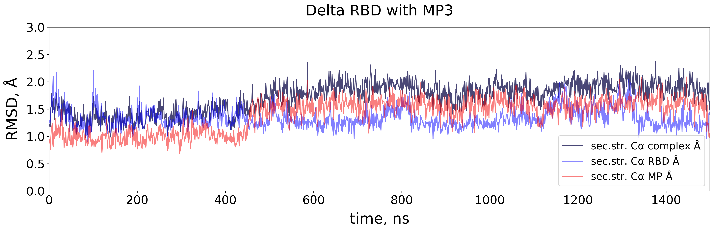
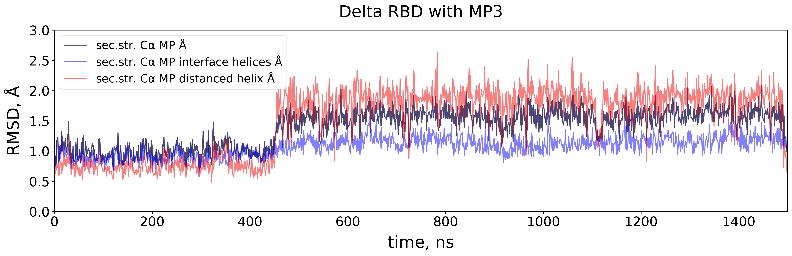

# 2. RMSD calculation and plotting
Requirements:
- pyxmolpp2

During this step the acquired trajectories are analysed to calculate and plot RMSD.

1. During complexes structures preparation the numbering in the files was switched from origonal rscb numbering to continuous. For the RMSD calculation and subsequent analyses the renumbered structure is created `protein_named.pdb` inside '0_prepare' subdir of Amber simulation dir. Check `mutants` variable inside the script to specify complexes for renumbering:
```sh
python renumber_residues_as_in_rcsb.py
```
2. `calc_rmsd_by_helix.py` will calculate RMSD of secondary structured Ca atoms across the trajectory with 1 ns stride (or 1000 frames, which can be changed in `stride` variable) and write output to .csv table in 'rmsd_output' dir. 5 columns will contain: time (ns), rmsd for MP, for RDB, for complex, for MP's helices on RDB interface, for MP's helix distanced from the interface. The list of complexes to be analyzed is listed in `mutants` variable:
```sh
python calc_rmsd_by_helix.py
```
3. The precomputed output .csv files are contained in 'tables' dir. They can be plotted with `plot_rmsd.py`. Provide path to folder with data and `-v` plotting key. 1 - will plot complex vs RBD and MP RMSD; 2 - MP vs helices RMSD.
```sh
python plot_rmsd.py -i ../tables -v 1
```
Note that possible mutants and corresponding titles are listed inside the script in `mutants`, `titles` variables. If you add new variants to the analysis, update those variables.

**Obtained results:**
As a result, RMSD plots are obtained for all simulated trajectories. Quite stable RMSD patterns are observed for all complexes, although there are minor fluctuations in some cases. Plotting RMSD complex vs RBD and MP and MP vs its helices suggests that such fluctuations can be attributed to shifts in flexible helix of MP. This result is confirmed by visual examination of trajectories. Nevertheless flexible regions do not affect inreface residues, which appear to be quite stable in time.

Below is an example for MP3/delta RDB complex:

<p align="center">
  
</p>

<p align="center">
  
</p>
